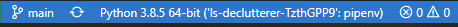
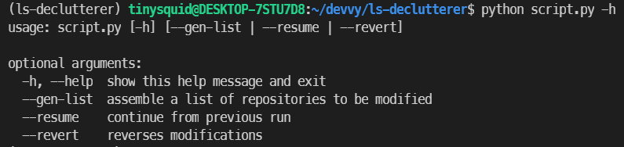

<sub>Banner image by [@aznbokchoy](https://unsplash.com/@aznbokchoy) on Unsplash</sub>

<h1 align="center">Lambda Forked Repo Declutterer</h1>

## Problem:

100+ repositories forked while in Lambda School causing:

- A cluttered repository list.
- Dependabot alert spam.

## Solution:

Rename and archive all of them so:

- Existing work is still available.
- No more notifications from alerts.
- Repos become read-only.
- Repos show up at the bottom of lists with prefixing on places like Netlify, Heroku, etc.

## Process:

Using Github's GraphQL API, we can fetch a list of a user's repositories and modify them. The steps are relatively straightforward:

- Fetch all _public_, _non-archived_, _forked_ repositories.
- Build a list to store references to repositories where the fork parent is from Lambda School.
- Iteratively rename and archive each repository.

To make the script more intelligent, we can create a progress file to track the state for each repository we are modifying. Then, if errors happen, we can resume where we left off at a later time.

Also, there should be a way to undo any work performed by the script, so a simple commandline arg interpreter will be needed.

## Env vars:

The script requires a `.env` file with some variables, so copy the `.env.example` file as a template:

```
> cp .env.example .env
```

- `GITHUB_USER` - This needs to be your login username. Used to match repository ownership in cases where you may have been a TL and had access to other student's repositories.

- `ACCESS_TOKEN` - This is a personal access token with a `public_repo` scope that you will need from Github.

See Github's [adding a personal access token guide](https://docs.github.com/en/github/authenticating-to-github/keeping-your-account-and-data-secure/creating-a-personal-access-token) for instructions.

- `REPO_PREFIX` - A prefix for the renamer to use. I use `zls` so I know its from LambdaSchool and `z` as first char so it pushes all the repos to the bottom of the list, but you can use anything.

## Running locally:

This project is managed with pipenv so you'll need that installed first. You will also need a `.env` file setup from the above section.

Install project dependencies and enter virtualenv shell:

```
> pipenv install
> pipenv shell
```

On vscode make sure you are using the virtualenv interpreter (`ctrl + shift + p` -> `Python: Select Interpreter`)

On the left of the status bar, you should see something like:



Run the script (full run):

```
> python script.py
```

I'd recommend trying the script in `--dry-run` first to see _what_ repositories it will be modifying.

```
> python script.py --dry-run
```

It will output a file to the `/data` directory called `dry-run.json`. From there, you can verify that you own the repositories and that the parent repository owner is LambdaSchool. With all the checks implemented in the script, I don't believe there will be issues, but it's best to be safe before mass modification.

## Usage:


